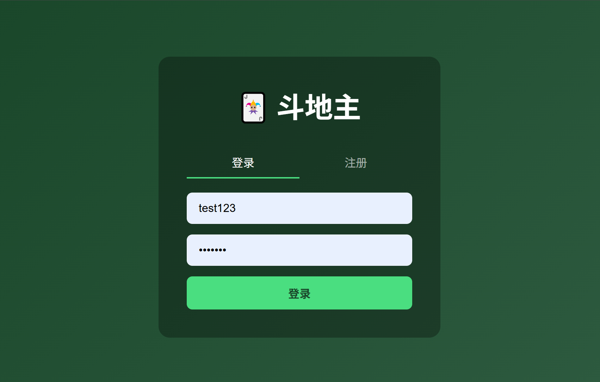
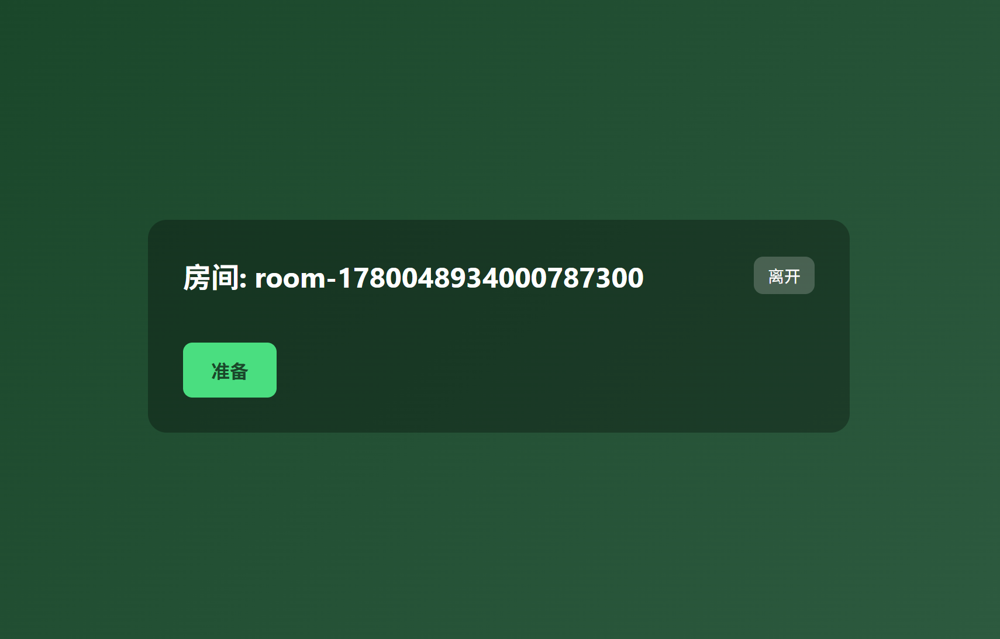
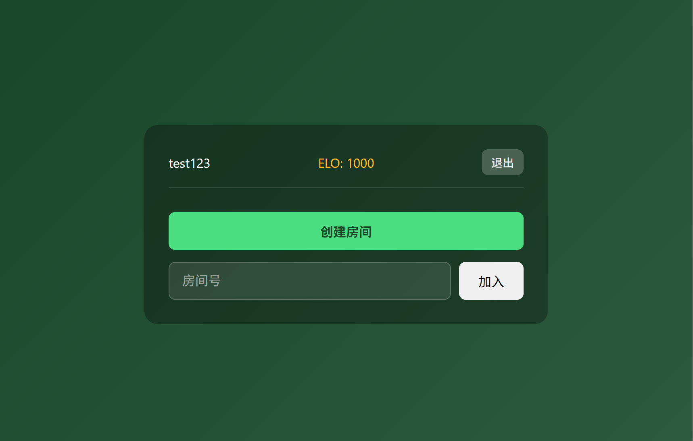
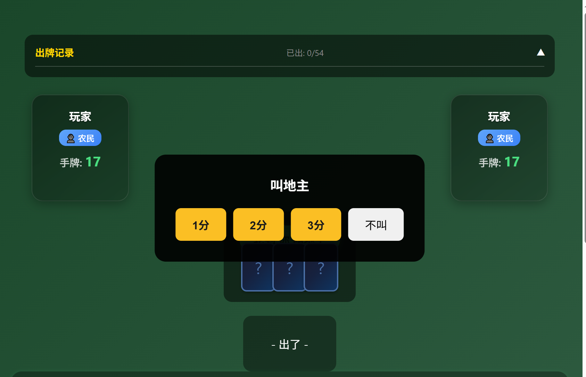
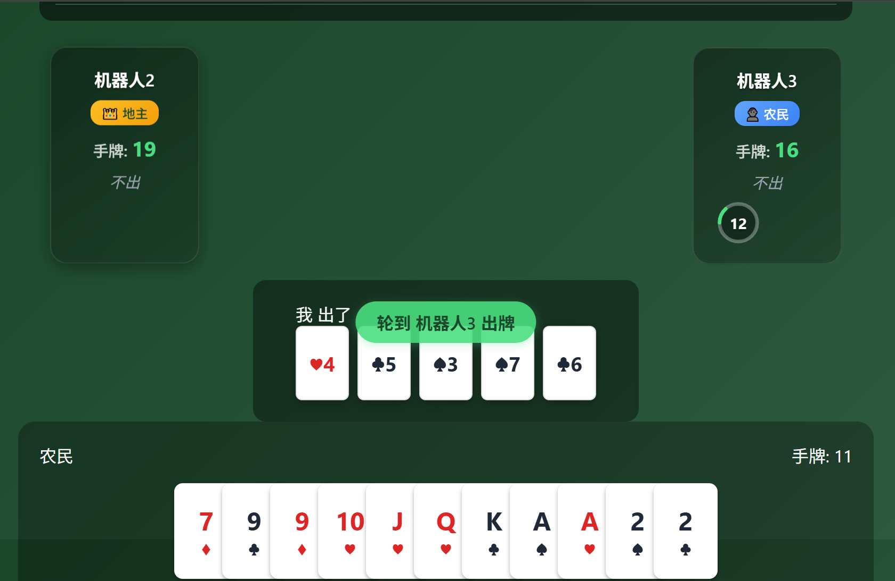
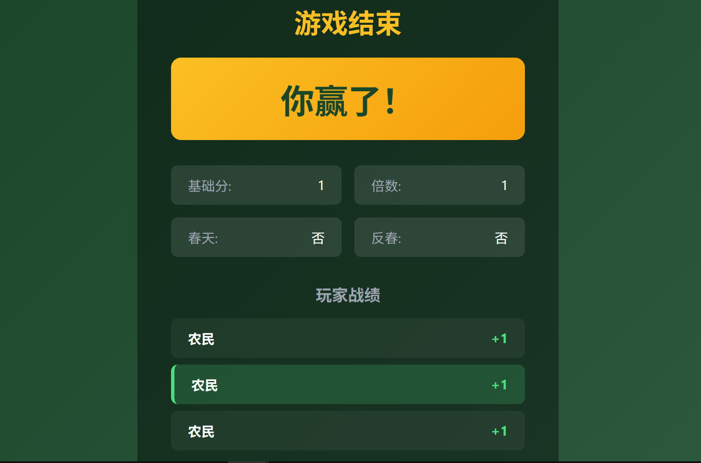

# go-zero-ddz


A classic three-player DouDiZhu (Landlord) online card game, built with go-zero backend + Web frontend.

## Project Overview


- **Game Type**: Classic three-player DouDiZhu (supports landlord/peasant roles, bidding, bombs, spring rules)
- **Backend**: go-zero (Go microservices framework), WebSocket long connections, JSON protocol
- **Frontend**: Web (HTML5/CSS/JavaScript, browser-based)
- **Data Storage**: Redis (room state, user sessions, match queue), MySQL (user data, match records)

## Architecture

```
                        ┌─────────────────────────────┐
                        │         Nginx / HAProxy       │
                        │     (WebSocket Load Balancing)│
                        └──────────┬──────────────────┘
                                   │
              ┌────────────────────┼────────────────────┐
              ▼                    ▼                    ▼
        ┌──────────┐        ┌──────────┐        ┌──────────┐
        │ Game-01  │        │ Game-02  │        │ Game-03  │
        │ :8080    │        │ :8080    │        │ :8080    │
        └────┬─────┘        └────┬─────┘        └────┬─────┘
             │                   │                   │
             └───────────────────┼───────────────────┘
                                 │
                    ┌────────────┴────────────┐
                    │       Redis Cluster      │
                    │  • Player Routing Table │
                    │  • Room Snapshots       │
                    │  • Pub/Sub Message Bus   │
                    │  • Matchmaking Queue     │
                    └──────────────────────────┘
```

### Services

| Service | Port | Protocol | Description |
|---------|------|----------|-------------|
| `user-api` | 8888 | HTTP/JSON | User service (login, register, JWT authentication) |
| `game-service` | 8080 | WebSocket | Game service (rooms, matchmaking, card playing, AI auto-play) |

## Project Structure

```
go-zero-ddz/
├── app/
│   ├── user/                       # User API Service
│   │   ├── etc/user-api.yaml       # Configuration
│   │   ├── user.go                 # Entry file
│   │   ├── user.api                # API definition
│   │   └── internal/
│   │       ├── config/             # Config struct
│   │       ├── handler/            # HTTP handlers (auto-generated)
│   │       ├── logic/              # Business logic
│   │       ├── svc/                # Service context
│   │       └── types/              # Type definitions
│   └── game/                       # Game WebSocket Service
│       ├── cmd/server/main.go      # Entry file
│       ├── etc/
│       │   ├── game-local.yaml     # Local config
│       │   └── game-prod.yaml     # Production config
│       └── internal/
│           ├── ai/                 # AI playing engine
│           ├── cluster/            # Cluster components
│           ├── config/             # Config definition
│           ├── game/               # Core game logic
│           │   ├── play.go         # Card playing logic
│           │   ├── call.go         # Landlord bidding logic
│           │   └── settlement.go   # Settlement logic
│           ├── handler/            # WebSocket handlers
│           ├── match/              # Matchmaking system
│           ├── room/               # Room management
│           ├── svc/                # Service context
│           └── websocket/          # WebSocket connection management
├── pkg/
│   ├── cardutil/                   # Card pattern recognition library
│   └── types/                      # Shared types and constants
├── proto/                          # Protobuf definitions
├── client-web/                     # Web frontend
├── images/                         # Project screenshots
├── sql/                            # Database init scripts
├── docker-compose.yml              # Docker compose
├── Dockerfile                      # Game service image
├── nginx/                          # Nginx config
├── k8s/                            # Kubernetes config
├── Makefile                        # Build scripts
└── AGENTS.md                       # Development guidelines
```

## Game Flow Screenshots

### 1. Login



Enter username and password to log in, supports new account registration.

### 2. Ready



After logging in, enter the ready screen and click "Start Match" to join the matchmaking queue.

### 3. Waiting for Players



After successful matchmaking, enter the room and wait for other players to ready or AI bots to join.

### 4. Landlord Bidding



After dealing cards, enter the landlord bidding phase. Players can choose to "Pass" or bid 1/2/3 points to become the landlord and receive the bottom cards.

### 5. Playing Cards



After confirming the landlord, enter the card playing phase. Players take turns playing cards, supporting various patterns like singles, pairs, triples, straights, consecutive pairs, airplanes, bombs, and rockets.

### 6. Game Settlement



The game ends when a player plays all their cards. Points are calculated based on win/loss and multipliers, with an ELO ranking system support.

## Core Features

### Supported Card Patterns

All standard DouDiZhu card patterns supported:

| Pattern | Description | Example |
|---------|-------------|---------|
| Single | Any single card | 3 |
| Pair | Two cards of same rank | 33 |
| Triple | Three cards of same rank | 333 |
| Triple+Single | Triple + single card | 333+4 |
| Triple+Pair | Triple + pair | 333+44 |
| Straight | 5+ consecutive singles (no 2s) | 34567 |
| Consecutive Pairs | 3+ consecutive pairs | 334455 |
| Airplane | 2+ consecutive triples | 333444+57 |
| Four+Two | Four of a kind + two cards | 3333+45 |
| Bomb | Four cards of same rank | 3333 |
| Rocket | Joker + Joker | 🃏🃏 |

### Matchmaking System

- **Random Match**: First-come-first-served, AI bots fill after 30s timeout
- **Ranked Match**: Based on ELO points, same tier priority
- **ELO System**: Separate scoring for landlord/peasant, considers multiplier and opponent rating difference

#### Rank Tiers

| Tier | ELO Range | Description |
|------|-----------|-------------|
| Bronze I-III | 0-1199 | New player protection |
| Silver I-III | 1200-1399 | - |
| Gold I-III | 1400-1599 | - |
| Platinum I-III | 1600-1799 | - |
| Diamond I-III | 1800-1999 | - |
| Master | 2000+ | Top players |

### AI Auto-play

- **Trigger Conditions**: Auto-enable after 15s idle, manual enable, reconnection
- **Difficulty Levels**: Easy (random), Normal (minimal valid), Hard (card counting + inference)
- **Strategy**: Card strength evaluation, situation analysis, bomb strategy, teammate recognition

## Quick Start

### Prerequisites

- Go 1.25+
- Redis 6+
- MySQL 8+ (optional, supports memory mode)
- Node.js (for frontend development)

### Local Development

```bash
# 1. Clone repository
git clone <repo-url>
cd go-zero-ddz

# 2. Install dependencies
go mod tidy

# 3. Start Redis and MySQL (Docker)
make docker-up

# 4. Start User API service
go run app/user/user.go -f app/user/etc/user-api.yaml

# 5. Start Game WebSocket service
go run app/game/cmd/server/main.go -f app/game/etc/game-local.yaml

# 6. Open browser and visit
# http://localhost:8080/
```

### API Endpoints

| Method | Path | Description | Auth |
|--------|------|-------------|------|
| POST | `/user/register` | Register a new user | None |
| POST | `/user/login` | Login with credentials | None |
| GET | `/user/info` | Get user information | JWT |

#### Register Example

```bash
curl -X POST http://localhost:8888/user/register \
  -H "Content-Type: application/json" \
  -d '{"username":"test","password":"123","nickname":"TestPlayer"}'
```

#### Login Example

```bash
curl -X POST http://localhost:8888/user/login \
  -H "Content-Type: application/json" \
  -d '{"username":"test","password":"123"}'
```

### WebSocket Protocol

Message frame format: `[Length 4B][MsgID 2B][JSON Payload]`

#### Message ID Ranges

| Range | Module | Description |
|-------|--------|-------------|
| `0x00xx` | System | Heartbeat, errors |
| `0x01xx` | Auth | Login, logout |
| `0x02xx` | Room | Create, join, ready |
| `0x03xx` | Matchmaking | Start match, match success |
| `0x04xx` | Game | Deal cards, bid, play, settlement |
| `0x05xx` | Reconnect | Reconnection |

## Cluster Deployment

### Docker Compose

```bash
# Start all services
make docker-up

# Stop all services
make docker-down
```

### Kubernetes

```bash
kubectl apply -f k8s/
```

### Scaling Strategy

| Component | Scaling Method | Description |
|-----------|---------------|-------------|
| Game Service | HPA | Auto-scale based on connection count |
| Redis | Redis Cluster | Up to 1000 nodes |
| MySQL | Master-Slave | Write to master, read from slaves |
| Nginx | Load Balancing | Least connection strategy |

## Environment Variables

| Variable | Default | Description |
|----------|---------|-------------|
| `REDIS_HOST` | `localhost:6379` | Redis address |
| `REDIS_PASS` | `` | Redis password |
| `MYSQL_DSN` | `` | MySQL DSN (empty = memory mode) |
| `CLUSTER_ENABLED` | `false` | Enable cluster mode |
| `INSTANCE_ID` | Auto-generated | Instance ID |
| `GAME_PORT` | `8080` | Game service port |
| `USER_PORT` | `8888` | User service port |
| `JWT_SECRET` | `ddz-secret-key-2025` | JWT secret |

## Performance

- **Single Instance Capacity**: 15,000+ concurrent WebSocket connections (5,000+ rooms)
- **Memory Usage**: ~1GB/instance
- **Message Latency**: <1ms (in-instance), <5ms (cross-instance)
- **Pattern Recognition**: <10μs per evaluation

## Testing

```bash
# Run all tests
go test ./... -v

# Run card pattern tests with coverage
go test ./pkg/cardutil/... -v -cover

# Race detection
go test -race ./...
```

## Development Roadmap

| Phase | Status | Description |
|-------|--------|-------------|
| P0 | ✅ Done | Protocol definition + message framing |
| P1 | ✅ Done | Card pattern library + tests |
| P2 | ✅ Done | User API (login/register/JWT) |
| P3 | ✅ Done | WebSocket Gateway |
| P4 | ✅ Done | Room Manager + Game State Machine |
| P5 | ✅ Done | Full game flow (deal → bid → play → settle) |
| P6 | ✅ Done | Matchmaking + AI Auto-play |
| P7 | ✅ Done | Web frontend |
| P8 | ✅ Done | Database integration |

## License

MIT License

## Contributing

Contributions are welcome! Please follow the guidelines in `AGENTS.md`.

## Contact

For issues and suggestions, please open an issue in the repository.
